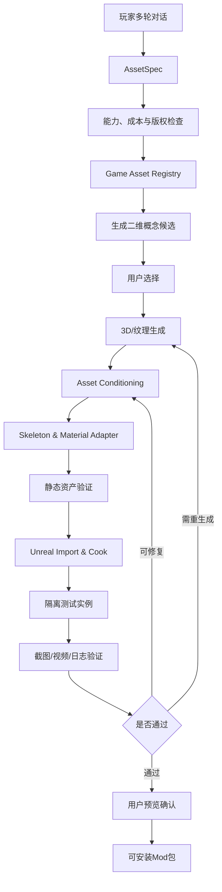

# Palworld AI Mod 创作平台：调研结论与实施规划

> 初始调研日期：2026-08-14
>
> 执行进度复核日期：2026-08-16
>
> 状态：产品与技术预研；实际执行状态以 [当前进度与断点续作手册](current-status-and-handoff.zh-CN.md) 为准
>
> 核心方向：纯 AI 完成游戏内模型/纹理生成与替换

## 1. 背景与产品假设

游戏玩家中存在大量潜在创作者。他们能够表达希望改变的角色外观、世界规则或玩法体验，却往往受限于以下门槛：

1. Mod 社区松散且去中心化，知识分散在论坛、Discord、Wiki、GitHub 和视频中；
2. 不清楚某个创意能否实现，以及应选择哪种框架；
3. 需要掌握 Blender、Unreal Engine、资源格式、Cook、打包和排错；
4. 游戏更新后存在兼容性、崩溃和存档风险；
5. 从创意到可安装产物的反馈周期过长。

本项目希望将这条链路压缩为：

```text
自然语言创意
→ 结构化需求
→ 生成视觉候选
→ 按任务类型先定模型或直接编辑纹理
→ 游戏资产适配
→ 自动构建与测试
→ 可安装 Mod
```

产品形态更接近 AI 短剧或 AI 内容创作平台，而非云端 Mod IDE。平台的价值不是单次生成代码，而是提供一条受约束、可验证、可迭代的创作生产线。

## 2. 市场与社区观察

### 2.1 Palworld Mod 类型分布

截至调研时，Nexus Mods 的 Palworld 分类页约有 3,200 个 Mod，主要分类为：

| 分类 | 数量 | 占比 |
|---|---:|---:|
| Gameplay | 1,376 | 43.0% |
| Pals | 510 | 15.9% |
| Visuals | 307 | 9.6% |
| Characters | 271 | 8.5% |
| Utilities | 213 | 6.7% |
| User Interface | 118 | 3.7% |
| Weapons | 112 | 3.5% |
| Miscellaneous | 83 | 2.6% |
| Outfits | 64 | 2.0% |
| Audio | 63 | 2.0% |
| Scripts | 54 | 1.7% |
| Animations | 26 | 0.8% |

跨 Steam Workshop、Nexus Mods、CurseForge 和社区讨论统一语义后，可粗略归纳为：

- QoL 与参数调整：30%～38%；
- 玩法规则与功能扩展：15%～22%；
- Pal、角色、服装及模型替换：25%～32%；
- 画面、声音及界面：8%～12%；
- 工具、管理和框架：5%～8%；
- 服务器与性能：2%～5%；
- 大型原创内容或 Overhaul：1%～3%。

Steam Workshop 的 `Model Replacement` 标签已经有百余个作品，证明模型替换具有明确的创作供给与消费需求。但同一作者可能为不同 Pal 分别发布条目，因此作品数量不应直接等价于独立需求人数。

### 2.2 产品机会

社区现状说明：

1. 参数化 QoL 是数量最大的低成本需求；
2. 模型、皮肤和服装替换具有更强的视觉传播能力；
3. 大型 Overhaul 虽然吸引力强，但实现和验证成本过高；
4. 当前缺少将 AI 资产生成、游戏适配、打包和验证整合起来的普通玩家产品。

因此，模型/纹理替换适合作为首版核心卖点，前提是对创作自由度做严格约束。

## 3. 产品定位与边界

### 3.1 推荐定位

产品不承诺“用一句话制作任意 Mod”，而应定位为：

> 用自然语言创造并安装属于你的 Palworld 角色外观与视觉变体。

首版围绕以下体验展开：

1. 玩家选择目标 Pal 或资产；
2. 用自然语言描述主题和变化；
3. 平台生成多张二维概念预览；
4. 玩家选择后，平台生成纹理或受限 3D 变体；
5. 自动适配原资产、Cook 并安装到测试环境；
6. 生成游戏内多角度截图或动作短视频；
7. 玩家确认并获得可安装、可卸载、可分享的 Mod。

### 3.2 核心约束

第一版必须遵守：

1. 不新增、删除或重命名骨骼；
2. 不改变骨骼父子关系；
3. 不生成新动画；
4. 不替换 Animation Blueprint；
5. 生成模型必须与目标参考姿势和身体结构兼容；
6. 只使用平台验证过的材质模板；
7. 必须通过标准动画预览；
8. 用户确认预览后才生成最终 Mod；
9. 失败时允许降级为仅纹理或简单附件版本。

在此边界内，问题可以从开放的 3D 制作收敛为受约束的资产转换。

### 3.3 支持等级

| 等级 | 范围 | 产品状态 |
|---|---|---|
| L0 | 纹理换色、图案、贴花、发光区域、UI 图标 | 正式支持 |
| L1 | 原 Mesh 受限变形、平台预制附件、静态物件 | 正式或 Beta |
| L2 | 同骨架、相似体型的全身模型替换 | Beta，必须视觉验收 |
| L3 | 新骨架、新动画、复杂物理、任意身体结构 | 暂不支持 |

## 4. 现有方案调研

### 4.1 结论

开源社区已经具备完整流水线的大部分组件，但尚未发现成熟的端到端开源产品能够无人值守完成：

```text
需求理解
→ 3D/纹理生成
→ 游戏目标资产适配
→ 骨架/蒙皮兼容
→ Unreal Cook
→ Mod 打包
→ 游戏内验证
```

现有产品通常停留在以下环节之一：

- AI 生成模型或纹理；
- Agent 控制 Blender；
- 将生成资产导入通用游戏引擎；
- 自动安装已有 Mod；
- 为特定 UGC 平台生成资产。

项目的差异化不应是训练新的 Text-to-3D 基础模型，而应是特定游戏的资产编译、验证和交付能力。

### 4.2 商业与平台参照

#### Tripo AI For Mod

Tripo 已经以 Mod 创作者为目标用户，提供 Text/Image-to-3D、纹理替换和主流格式导出。它更接近资产供应商，尚未覆盖 Palworld 目标资产识别、骨架适配、Cook、安装和游戏内验证。

#### Roblox Cube 3D

Roblox 已将文本生成 3D Mesh 集成进 Studio 和运行时 API，是最接近完整垂直 UGC 生产线的参照。Roblox 的优势是同时控制生成模型、引擎、资产规范、发布和审核。第三方游戏 Mod 平台必须自行建设这些 Adapter。

### 4.3 开源生成模型

#### Hunyuan3D

具备：

- Image-to-3D；
- 几何与纹理两阶段生成；
- 为已有 Mesh 生成纹理；
- GLB/OBJ 输出；
- API Server；
- 异步任务状态；
- Blender Add-on。

它与 Agent Harness 的接口契合度较高，但商业产品必须逐版本核实自定义许可、权重许可和输出物使用条件。

#### Microsoft TRELLIS

能够生成高质量 Mesh 与纹理，官方提供推理 Pipeline。模型和大部分代码使用 MIT License，但仍需审查具体权重、依赖和使用条件。原始输出不是天然的 Game-ready Asset，仍需后处理。

#### ComfyUI 生态

适合承载：

- 概念图生成；
- 多视图生成；
- 背景移除；
- 原 UV 约束下的纹理编辑；
- 法线、粗糙度等贴图工作流；
- 工作流版本化和异步队列。

ComfyUI 的 `/prompt`、队列和工作流 JSON 适合封装为确定性生成服务。

### 4.4 Blender Agent 与 MCP

社区已经存在多个 Blender MCP：

- `RFingAdam/mcp-blender`；
- `ahujasid/blender-mcp`；
- `PatrykIti/blender-ai-mcp`；
- 组合 Alpha3D、Tripo、Meshy 与 Blender MCP 的 Agent Skill。

这些项目证明 Agent 可以完成导入、缩放、材质、渲染和迭代修改。但生产环境不应让 Agent 每次自由生成任意 `bpy` 代码，而应封装确定性的高层工具。

### 4.5 Palworld 人工模型替换方案

当前社区已经形成相对稳定的人工工作流：

```text
FModel + Palworld mappings
→ 导出原始 Mesh、纹理、Skeleton 和路径
→ Blender 修改或替换
→ UE 5.1.1 导入
→ 重建原始资产路径和名称
→ PrimaryAssetLabel / Chunk Cook
→ Pak
→ Palworld Mod Uploader / Steam Workshop
```

该工作流支持：

- Pal/NPC Skeletal Mesh；
- 武器、物品等 Static Mesh；
- 玩家、Pal 和世界纹理；
- 图标和 HUD 资源。

稳定性的核心条件是保持原始资产路径、名称、Skeleton 兼容性和材质引用。

## 5. 核心底层能力

### 5.1 AssetSpec

所有系统围绕结构化 `AssetSpec` 工作，避免让 Agent 直接操作最终资产：

```json
{
  "game": "Palworld",
  "gameVersion": "1.0.x",
  "targetAsset": {
    "type": "pal",
    "id": "NegativeKoala",
    "replacementMode": "texture_and_mesh",
    "keepSkeleton": true,
    "keepAnimations": true
  },
  "appearance": {
    "theme": "ice crystal",
    "colors": ["white", "light blue", "purple"],
    "silhouetteChanges": ["larger ears", "crystal spikes on back"]
  },
  "constraints": {
    "maxTriangles": 50000,
    "maxMaterials": 4,
    "textureResolution": 2048,
    "allowNewBones": false,
    "allowNewAnimations": false
  }
}
```

### 5.2 Game Asset Registry

平台需离线建立版本化资产索引：

- 资产 ID 与 Unreal 路径；
- Static/Skeletal Mesh 类型；
- Skeleton 与 Physics Asset；
- 材质槽和纹理通道；
- 原点、比例、Bounding Box；
- 三角面、LOD 和碰撞；
- 动画测试集合；
- 游戏版本和兼容状态。

FModel 更适合离线索引，不适合每个用户任务实时由 Agent 操作。平台应定期导出并把结果转换为自身数据库。

### 5.3 Image Generation Service

职责：

- Prompt 增强；
- 原角色多视图条件；
- 多个概念候选；
- UV 感知纹理生成；
- Alpha 和通道保护；
- 风格一致性；
- 内容审核。

必须先让用户确认低成本二维概念方向，再进入昂贵 3D 阶段。若需求会改变轮廓或增加几何体，概念图只用于确定方向；最终纹理必须在模型、材质槽与 UV 定稿后生成。

### 5.4 3D Generation Gateway

统一接入商业和开源 Provider：

```text
create_job
get_job_status
cancel_job
download_artifact
get_cost
get_model_metadata
```

首版应同时支持：

1. Full Mesh Generation：主要用于静态物件和附件；
2. Mesh-Constrained Generation：基于原 Mesh 做受限变体；
3. Texture-only：保留原 Mesh，仅生成材质和纹理。

### 5.5 Asset Conditioning

所有生成物必须经过确定性处理：

```text
格式解析
→ 安全检查
→ 坐标与单位归一化
→ 原点对齐
→ 非流形/法线/重复顶点修复
→ 三角化
→ 降面或 Retopo
→ UV 检查
→ 材质与 PBR 通道整理
→ LOD/碰撞
→ 骨架兼容和权重检查
→ 导出
```

候选工具包括 Blender `bpy`、`trimesh`、Open3D、PyMeshLab 和 glTF Validator。

### 5.6 Skeleton Adapter

在不修改骨架和动画的前提下：

- 加载目标参考姿势；
- 计算形体兼容评分；
- 对齐关节和 Mesh；
- 保留或转移原权重；
- 清理并归一化权重；
- 检测无权重顶点；
- 限制每顶点骨骼影响数量；
- 使用标准动作检测变形。

最大风险不是骨架本身，而是蒙皮权重和形体差异。新旧模型形体越接近，自动化成功率越高。

### 5.7 Material Adapter

第一版只允许平台维护的材质模板：

- Base Color；
- Normal；
- Roughness；
- Metallic；
- Emissive；
- Opacity/Mask；
- 材质槽命名；
- 纹理尺寸和压缩；
- 双面和透明模式。

不允许 Agent 自由生成任意 Unreal Material Graph。

### 5.8 Unreal Builder

使用锁定版本的 UE 5.1.1 Worker：

1. 创建目标资产目录；
2. 导入 Mesh 与纹理；
3. 指定原 Skeleton/Physics Asset；
4. 重建材质实例；
5. 恢复原始文件名；
6. 创建 `PrimaryAssetLabel`；
7. 分配 Chunk；
8. 命令行 Cook；
9. 提取 Pak；
10. 生成 Mod Package；
11. 安装到隔离游戏实例。

Builder 必须确定性运行，不应依赖 Agent 临场编写脚本。

### 5.9 Runtime Test 与视觉验证

测试场景至少覆盖：

- 站立、行走、奔跑；
- 跳跃、攻击、受击；
- 召唤、倒地；
- 骑乘或被抱起；
- 近景、远景和不同光照；
- 多角度截图与旋转视频。

确定性检测包括：

- 游戏是否启动；
- Pak 是否加载；
- 资产和材质是否存在；
- Missing Asset、T-Pose、NaN 或顶点爆炸；
- Bounding Box 和日志异常。

视觉模型检测包括：

- 穿模；
- 比例异常；
- 材质发黑；
- 关节变形；
- 风格偏离；
- 纹理接缝。

视觉模型只能做质量筛选，最终仍需用户确认。

## 6. Agent Harness 支持程度

| 能力 | 支持程度 | 结论 |
|---|---:|---|
| 对话与需求结构化 | 高 | 已成熟 |
| ComfyUI/Image API | 高 | 异步队列和工作流完善 |
| 商业 3D API | 高 | 适合任务化调用 |
| Hunyuan3D 本地 API | 中高 | 工程接口完整，需解决部署与许可 |
| Blender Python | 高 | 可完全脚本化 |
| Blender MCP | 中高 | 原型能力强，生产需收敛工具面 |
| Mesh 静态检查 | 高 | 应使用确定性程序 |
| 自动 Retopo/UV | 中 | 可运行但质量不稳定 |
| 自动权重转移 | 中 | 相近形体可用，差异大时失败率高 |
| FModel 资产索引 | 中低 | 建议离线预处理 |
| Unreal 自动导入 | 中高 | 需锁定 UE 5.1.1 |
| Unreal Cook/Pak | 高 | 命令行方案成熟 |
| Palworld 打包安装 | 中高 | 路径和规范明确 |
| 游戏启动与日志检查 | 中 | 可自动化 |
| 游戏内行为驱动 | 中低 | 缺少官方 Test Harness |
| 视觉质量判断 | 中 | 可发现明显问题，不能保证审美 |
| 自动修复穿模/权重 | 低—中 | 首版主要风险 |
| 跨游戏复用 | 低 | 每款游戏需要专用 Adapter |

Agent 负责需求理解、策略选择、错误解释和有限重试；Workflow Engine 负责状态、调度、幂等、缓存、费用和审计；确定性工具负责模型处理、权重、材质、Cook、打包和测试。

不建议使用“一个大 Agent + Shell”承担整条生产线。

## 7. 总体架构



建议服务划分：

```text
Conversation Service
AssetSpec Service
Game Asset Registry
Image Generation Service
3D Generation Gateway
Blender Worker
Mesh Validation Service
Palworld Adapter
Unreal Build Worker
Runtime Test Worker
Vision Review Service
Artifact & Version Service
Moderation & Provenance Service
```

## 8. 分阶段实施规划

### Phase 0：全链路技术验证

限制为：

- 1只 Pal；
- 1个目标资产路径；
- 1套材质；
- 1种纹理工作流；
- 1种 3D Provider；
- 1套动作测试。

验收：

- `Prompt → Pak → 游戏截图` 无人工点击；
- 每一步输出结构化状态和产物；
- 失败可以定位到具体阶段；
- 可重复构建；
- 不可逆修改不得作用于用户原游戏目录。

### Phase 1：AI Pal Skin MVP

支持：

- 10～20只热门 Pal；
- 换色、图案、主题皮肤；
- 发光区域；
- 少量材质风格；
- 3个二维候选；
- 游戏内旋转展示；
- 一键安装和卸载；
- Workshop 兼容包。

建议指标：

- 首次成功率大于 90%；
- 端到端时间小于 5 分钟；
- 绝大多数失败无需技术人员介入。

### Phase 2：静态 Mesh 与附件

支持：

- 武器、家具和装饰物；
- 头部、背部等预置插槽附件；
- 模型格式、面数、材质和纹理规格限制；
- 自动归一化、降面、UV/PBR 检查；
- 预览场景和碰撞/LOD。

### Phase 3：同骨架 Pal 替换

支持：

- 3～5只骨架和体型简单的 Pal；
- 与原形体相近的生成模型；
- 自动权重转移；
- 标准动画回归；
- 视觉质量检查；
- 用户最终确认。

失败降级路径：

```text
完整 Mesh 替换失败
→ 原 Mesh + 简单附件失败
→ 原 Mesh + AI 纹理
```

### Phase 4：规模化与多游戏

在 Palworld 稳定后抽象：

```text
GameAssetAdapter
MaterialAdapter
SkeletonAdapter
BuildAdapter
InstallAdapter
RuntimeTestAdapter
```

第二款游戏优先选择具有官方 SDK、清晰资产格式、命令行构建和 Workshop/UGC 分发能力的目标。

## 9. 成本与指标

每个任务记录：

```text
LLM Token Cost
Image Generation Cost
3D Generation Cost
GPU Seconds
Blender Worker Time
Unreal Worker Time
Game Test Time
Artifact Storage
Retry Cost
```

核心指标：

- 从 Prompt 到二维预览的时间；
- 用户选择候选的比例；
- 进入 3D 阶段的比例；
- Mesh 静态检查通过率；
- Cook 成功率；
- 游戏启动与资产加载成功率；
- 动画回归通过率；
- 自动修复次数；
- 最终安装率和分享率；
- 单次成功创作总成本；
- 每个目标 Pal 的失败率。

## 10. 风险与治理

| 风险 | 应对措施 |
|---|---|
| 3D结果好看但不可用于游戏 | 强制 Asset Conditioning，不直接使用原始生成物 |
| 同骨架模型动画仍变形 | 形体兼容评分、权重转移和动作回归 |
| UE Cook 成本过高 | 常驻 Worker、预热缓存、模板项目和增量构建 |
| 游戏更新破坏路径 | Asset Registry 版本化和更新回归 |
| AI 内容引发社区反感 | 明确披露、质量门槛、限制批量公开发布 |
| 第三方 IP 和真实人物风险 | 输入权利声明、相似性检测和高风险 Prompt 拦截 |
| 开源模型许可不适合商业使用 | Provider 可替换，逐版本完成法务审查 |
| Agent 误操作 | 工具白名单、隔离工作区和不可变游戏基线 |
| 自动生成大量低质量 Mod | 发布前预览、审核和公开发布频率限制 |

平台需要保存完整来源链：Prompt、参考图、模型版本、Seed、生成步骤、产物 Hash、用户权利声明和 AI 内容标签。

## 11. 近期建议决策

1. 将首版明确命名为 `AI Pal Skin` 或类似概念，先证明视觉生成到可安装 Mod 的闭环；
2. 优先做 Texture-only，随后扩展到原 Mesh 受限变形和平台附件；
3. 选择一个商业 3D API 和一个可替换的开源后端，避免被单一 Provider 锁定；
4. 用确定性 Blender/Unreal 工具构建生产线，MCP 主要用于研发探索；
5. 建立 Palworld Asset Registry 和隔离游戏测试环境，这是核心资产；
6. 在 Phase 0 就加入来源记录、版权治理和 AI 标签；
7. 以成功交付率、端到端时间和单次成本作为核心评价，而非只评价生成模型的视觉惊艳程度。

## 12. 两轮 ChickenPal 验证结论（2026-08-16）

### 12.1 已验证事实

第一轮证明了原 UV 纹理编辑链路可用：源纹理合同、尺寸、Alpha、通道、Blender 原模型/骨架绑定预览以及 Texture2D Pak 注入都能被确定性验证。

第二轮证明了受限模型定制的局部能力：在不修改骨架层级的前提下，可以锐化翅膀与头冠区域，并增加绑定到已有骨骼的刚性装甲附件；PSK 可重新导入 Blender 并完成多角度预览。

同时暴露出一个关键顺序错误：机械纹理先于新装甲几何生成。原身体的拓扑和 UV 虽然仍有效，但 4 个新附件最初各自占满 0–1 UV 空间，彼此重叠，因而此前通过 21/21 二维检查的纹理只能算机械风格概念参考，不能算匹配最终模型的纹理。

### 12.2 修正后的任务路由

```text
纯换色/图案
→ 原 UV 纹理生成 → 2D 校验 → 原模型预览 → Texture Pak

仅变形且 UV 不变
→ 模型定稿 → 骨架/拓扑/UV 哈希校验 → 纹理生成 → Blender 预览

新增附件或拓扑
→ 模型 Blockout → 骨架绑定 → 几何定稿
→ 身体保留原 UV + 附件独立 Atlas
→ 烘焙几何引导图 → 分材质生成纹理
→ Blender 预览 → UE 5.1.1 Reimport/Cook → Pak → 运行时回归
```

### 12.3 本轮新增产物与边界

已为 ChickenPal 的 4 块机械装甲建立 1024×1024、2×2 分区的独立 atlas，验证每个附件占用唯一 UV 单元且原身体 UV 不变；已输出 UV Coverage 与 Material-ID 引导图，并冻结 `ModelSurfaceContract`。随后以该合同生成机械装甲 Base Color，强制回写尺寸与 Coverage 遮罩，并在冻结模型上完成身体、眼睛、装甲材质绑定及四视图 Blender 预览。

当前新增装甲 Base Color 已是 `model_matched_attachment_base_color`，并已生成低模 AO、自烘焙切线 Normal、Pointiness 曲率近似、MRAO 和橙色 Emissive Mask；PBR 节点绑定与 Blender 四视图验证通过。UV 定稿后的最终 PSK 也已完成导出—回导验证，5074 顶点、8652 面、39 个骨骼/Socket、3 个材质槽和 4 个附件 UV 均往返一致。

已生成 UE 5.1.1 导入 Bundle，固定目标 SkeletalMesh、原 Skeleton、Physics Asset、材质槽、纹理压缩与 MRAO 通道合同。当前仍未完成高低模细节烘焙、UE 5.1.1 SkeletalMesh Reimport/Cook、动画与 Physics Asset 游戏内回归；直接阻塞是本机尚未配置 UE 5.1.1 Editor。因此整体状态为 `Blender model-matched PBR preview + finalized PSK ready`，不能标记为可部署模型 Mod。

## 13. fal.ai 境内采购与 Provider 替代调研（2026-08-20）

### 13.1 调研结论

截至 2026-08-20，未从 fal.ai 官方网站、文档、法律条款或公开合作伙伴页面中查到经过 fal.ai 明确认证的中国大陆 credits 代理商或经销商。市场上的“代充”“虚拟卡充值”和“API 中转”不能据此表述为 fal.ai 官方代理。

fal.ai 官方当前采用美元预付 credits 模式，公开条款列出的自助支付方式为 payment card；ACH 主要适用于美国银行账户。官方没有公开列出支付宝、微信支付、人民币或中国银联直连通道。因此，能够在用户自有 fal.ai 账户中形成官方 credits 的可信路径仍是：

1. 在 fal.ai Billing 使用本人或本企业合法持有、支持境外线上美元支付的银行卡；
2. 申请 fal.ai 面向欧洲和亚洲团队开放的 Builder Grant 或 Startup Program；
3. 对较大规模的企业需求直接联系 fal.ai Sales/Support，取得书面报价和账户安排。

不把私人代充、共享账号、来源不明的虚拟卡或没有授权文件的中转站纳入 Golden Path。这些方案可能引入拒付、封号、余额不可追索、API Key 泄露和输入资产外泄风险。

### 13.2 境内可用方案分级

| 方案 | 是否获得 fal.ai 官方 credits | 当前证据等级 | Harness 决策 |
|---|---:|---|---|
| fal.ai 官方直充 | 是 | 官方计费与法律条款 | 保留为官方基准 Provider |
| fal.ai Builder Grant / Startup Program | 是 | 官方申请页面，面向欧洲和亚洲团队 | 优先申请，用于基准和少量关键候选 |
| RunningHub 国内平台 | 否 | 境内运营主体、用户协议、隐私政策、API 文档和人民币计费页面 | 作为独立境内 Provider 评估，不标记为 fal 代理 |
| 阿里云百炼 | 否 | 国内云厂商官方模型市场、计费与 API 文档 | 继续作为 Tripo/HY-3D 类独立 Provider |
| 国内 API 聚合中转站 | 否 | 多数只有自述，缺少上游授权、版本和 SLA 证据 | 默认不进入生产 Provider Registry |
| 私人代充或共享账户 | 不确定 | 无法核验 | 禁止进入 Golden Path |

### 13.3 RunningHub 的适用边界

RunningHub 国内站公开的运营主体为安徽海马云智能科技发展有限公司，提供人民币钱包/RH 币、境内第三方支付、任务费用明细、API Key、模型 API、AI 应用 API 和 ComfyUI 工作流 API。其隐私政策说明境内运营数据存储于中国境内，并列出微信、支付宝等支付机构参与支付处理。

因此 RunningHub 可作为“境内托管开源 3D 工作流/境内 3D Model API Provider”的候选，适合低成本批量候选生成和人民币结算。但它不是 fal.ai 代理；即使运行同名 TRELLIS 或兼容 ComfyUI 工作流，也不能假定其模型权重、版本、推理代码、参数、GPU、输出质量和 fal.ai `fal-ai/trellis` endpoint 相同。

接入前必须使用同一输入集完成对照验证，并分别记录：

```text
provider / endpoint / workflowId
model name / model version / node versions
input hashes / seed / parameters
estimated cost / actual cost / runtime
output hash / format / polygon count / texture channels
download retention / data retention
geometry review / Blender import / skeleton binding / UE Cook / game runtime evidence
```

RunningHub 当前公开的 3D 能力包括混元图生 3D、Hitem3D，以及可运行的社区 3D ComfyUI 工作流。是否存在满足本项目要求、可稳定导出 GLB 的 TRELLIS 工作流，需要以实际复制到工作台、网页成功运行一次及 API round-trip 为准，不能只凭工作流标题判断。

### 13.4 聚合中转站准入门槛

调研中发现部分聚合站声称能够替代 fal.ai 或比 fal.ai 低价，但仅凭产品页中的“官方渠道”“99.9% SLA”“节省 70%”等自述，无法证明上游授权和交付稳定性。任何第三方 Provider 进入 Registry 前必须同时满足：

1. 可核验的境内或境外运营主体、服务条款、隐私政策和客服渠道；
2. 明确说明是否为 fal.ai 授权代理、API 转售、开源模型自托管或其他上游；
3. 给出准确 endpoint、schema、模型版本、计费单位、失败扣费和退款规则；
4. 支持独立 API Key、余额限额、调用账单、密钥轮换和任务追踪；
5. 明确输入、输出、日志的存储地域、保存期限和删除机制；
6. 使用非敏感样例通过小额充值、生成、下载、账单核对和故障恢复测试；
7. 质量、成本和可用性通过 Harness 自有基准，不依赖供应商宣传结论。

未满足以上条件时，Provider 状态只能是 `research_only`，不得承载私有参考图、未公开 IP 资产或生产任务。

### 13.5 当前推荐的双 Provider 策略

近期优先实现并比较两条独立链路：

```text
fal_trellis
  官方 endpoint + 自有 fal key/官方赠送 credits
  用途：质量与成本基准、关键候选复核

runninghub_workflow
  境内人民币结算 + 托管开源 3D 工作流
  用途：低成本候选、Provider 可替换性和境内可用性验证
```

两条链路必须输出统一的 Provider Report，但 `provider_generated_unvalidated` 不能因为任务成功或 GLB 文件存在而晋升为“可部署 Mod”。后续仍需经过 Blender 几何检查、同骨架绑定、UE Import/Cook、游戏加载和截图/日志回归。

如果 RunningHub 的同类工作流无法在质量或单次成本上接近 fal.ai TRELLIS，则保留本地 SPAR3D/TripoSR 作为零边际成本候选，并将阿里云百炼的 Tripo/HY-3D 作为质量升级选项，而不是转向缺少主体与授权证据的代充或中转服务。

### 13.6 当前降级替代方案的成本目标

当前 Provider 调研和 Harness 接入的首要目标，是找到一个单次成功生成“3D 模型 + 有效 UV + 可用基础纹理”的降级替代方案，并将单个合格候选的外部边际成本尽可能控制在 **人民币 0.50 元以下**。

这里的“单次成功生成”不能只按 API 返回成功或存在 GLB 文件计算，至少需要满足：

1. 输出可下载的 Mesh，能够被 Blender 无错误导入；
2. 存在有效 UV Layer，UV 坐标有限且能驱动纹理采样；
3. 同时输出或生成与该 UV 对应的 Base Color/基础纹理；
4. 模型和纹理能够在统一预览器中绑定渲染，而不是只有供应商网页截图；
5. 输出文件、参数、Seed、费用和 Hash 可记录并复现；
6. 通过基础 Artifact Contract 后，才计为一个合格候选。

成本使用“合格候选摊销成本”而不是供应商宣传单价：

```text
合格候选摊销成本
= 为获得这些候选产生的全部生成费、失败任务扣费、纹理费、付费云 GPU 运行费和必要支付手续费
/ 通过基础 Artifact Contract 的候选数量
```

本地已有硬件执行的 Blender 检查、Rigging、UE Import/Cook 和游戏验证不计入上述 `¥0.50` Provider 生成门槛，但必须在完整任务成本中单独记录；如果使用付费云 GPU 执行生成或纹理阶段，其实际运行费用必须计入。汇率换算应记录结算日、实际扣款金额和支付手续费，不能只用美元目录价估算。

候选路线优先级调整为：

```text
P0  本地 SPAR3D/TripoSR + 本地确定性 UV/纹理投射
    目标：外部边际成本接近 0，验证质量下限和自动化稳定性

P1  RunningHub 托管开源 3D 工作流
    目标：以人民币结算，实测合格候选摊销成本 < ¥0.50

P2  fal.ai legacy TRELLIS
    目标：在可合法获得 credits 时作为低价质量基准和回归锚点

P3  Tripo/HY-3D/TRELLIS.2 等高价 Provider
    定位：仅在低价路线连续失败或用户明确批准后升级，不作为默认 Golden Path
```

Provider Registry 应新增并强制记录以下成本字段：

```json
{
  "currency": "CNY",
  "listedCost": 0.0,
  "actualDebitedCost": 0.0,
  "paymentFee": 0.0,
  "failedAttemptCost": 0.0,
  "qualifiedCandidateCount": 0,
  "amortizedQualifiedCost": 0.0,
  "targetQualifiedCost": 0.5,
  "meetsDegradedCostTarget": false
}
```

`meetsDegradedCostTarget=true` 只表示成本目标达标，不代表资产已经完成同骨架绑定、UE Cook 或游戏运行验证。成本、几何/纹理质量和可部署性继续作为三条独立证据轴管理。

## 14. 参考资料

- [Palworld Modding Docs：3D Asset Swapping](https://pwmodding.wiki/docs/developers/3d-modeling/asset-swapping/Home)
- [Palworld Modding Docs：Exporting & Modifying 3D Assets](https://pwmodding.wiki/docs/developers/3d-modeling/asset-swapping/ExportingModifying3DAssets)
- [Palworld Modding Docs：Packaging through UE5](https://pwmodding.wiki/docs/developers/3d-modeling/asset-swapping/PackagingInUE5)
- [Palworld Steam Workshop：Model Replacement](https://steamcommunity.com/workshop/browse/?appid=1623730&requiredtags%5B%5D=Model+Replacement)
- [Nexus Mods：Palworld Categories](https://www.nexusmods.com/palworld/mods/categories)
- [Palworld Mod Uploader](https://github.com/pocketpairjp/PalworldModUploader)
- [Hunyuan3D-2](https://github.com/Tencent-Hunyuan/Hunyuan3D-2)
- [Hunyuan3D-2.1 API Documentation](https://github.com/Tencent-Hunyuan/Hunyuan3D-2.1/blob/main/API_DOCUMENTATION.md)
- [Microsoft TRELLIS](https://github.com/microsoft/TRELLIS)
- [Roblox Cube](https://github.com/Roblox/cube)
- [Roblox Studio Assistant](https://create.roblox.com/docs/assistant/guide)
- [ComfyUI API Routes](https://docs.comfy.org/development/comfyui-server/comms_routes)
- [mcp-blender](https://github.com/RFingAdam/mcp-blender)
- [blender-mcp](https://github.com/ahujasid/blender-mcp)
- [blender-ai-mcp](https://github.com/PatrykIti/blender-ai-mcp)
- [BlenderXAlpha-3DGenSkill](https://github.com/ig-shadow-walker/BlenderXAlpha-3DGenSkill)
- [Unreal Engine Build Operations](https://dev.epicgames.com/documentation/unreal-engine/build-operations-cooking-packaging-deploying-and-running-projects-in-unreal-engine)
- [Tripo AI For Mod](https://www.tripo3d.ai/mod)
- [fal.ai Pricing](https://fal.ai/docs/documentation/model-apis/pricing)
- [fal.ai Terms of Service](https://fal.ai/legal/terms-of-service)
- [fal.ai Builder Grant](https://fal.ai/builder-grant)
- [fal.ai Startup Program](https://fal.ai/startup-program)
- [fal.ai TRELLIS API](https://fal.ai/docs/model-api-reference/3d-api/trellis)
- [RunningHub 国内站](https://www.runninghub.cn/)
- [RunningHub 用户协议](https://www.runninghub.cn/protocol)
- [RunningHub 隐私政策](https://www.runninghub.cn/policy)
- [RunningHub 付费协议](https://www.runninghub.cn/defray-protocol)
- [RunningHub API 文档](https://www.runninghub.cn/runninghub-api-doc-cn/)
- [RunningHub 模型 API 列表](https://www.runninghub.cn/call-api/search-api/standard-model)
- [阿里云百炼 3D 模型生成](https://help.aliyun.com/zh/model-studio/3d-generation/)
